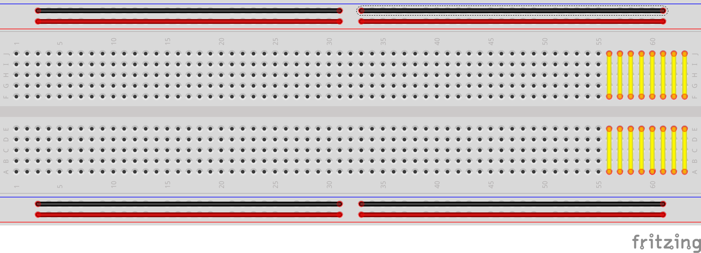
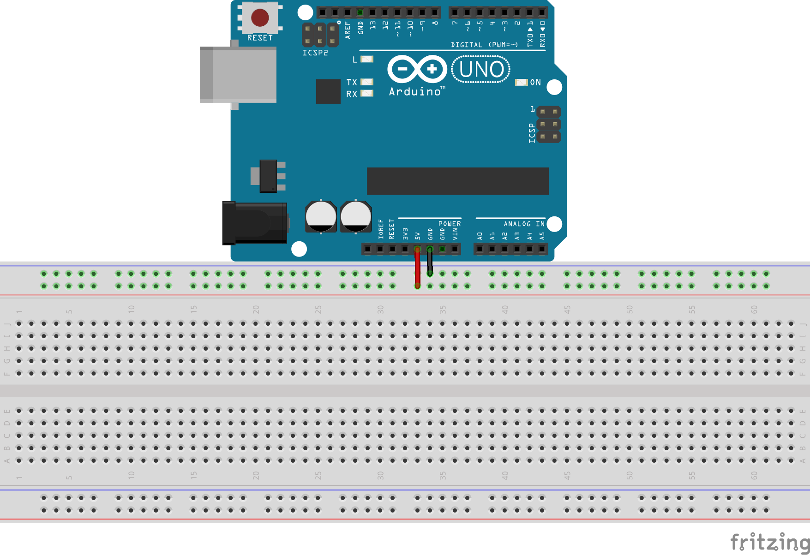
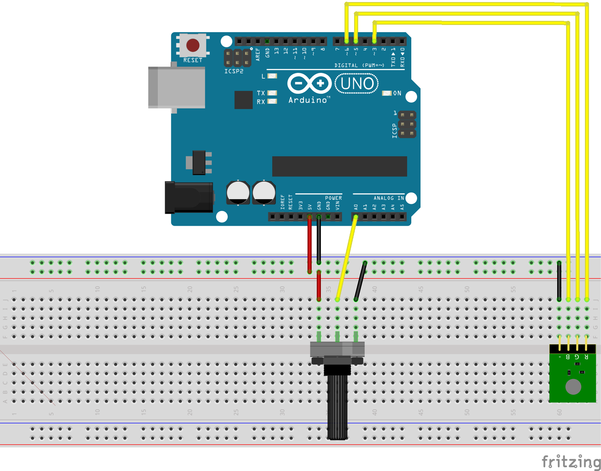
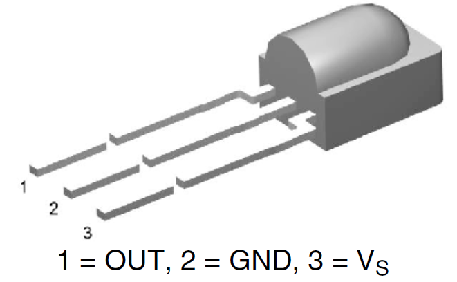
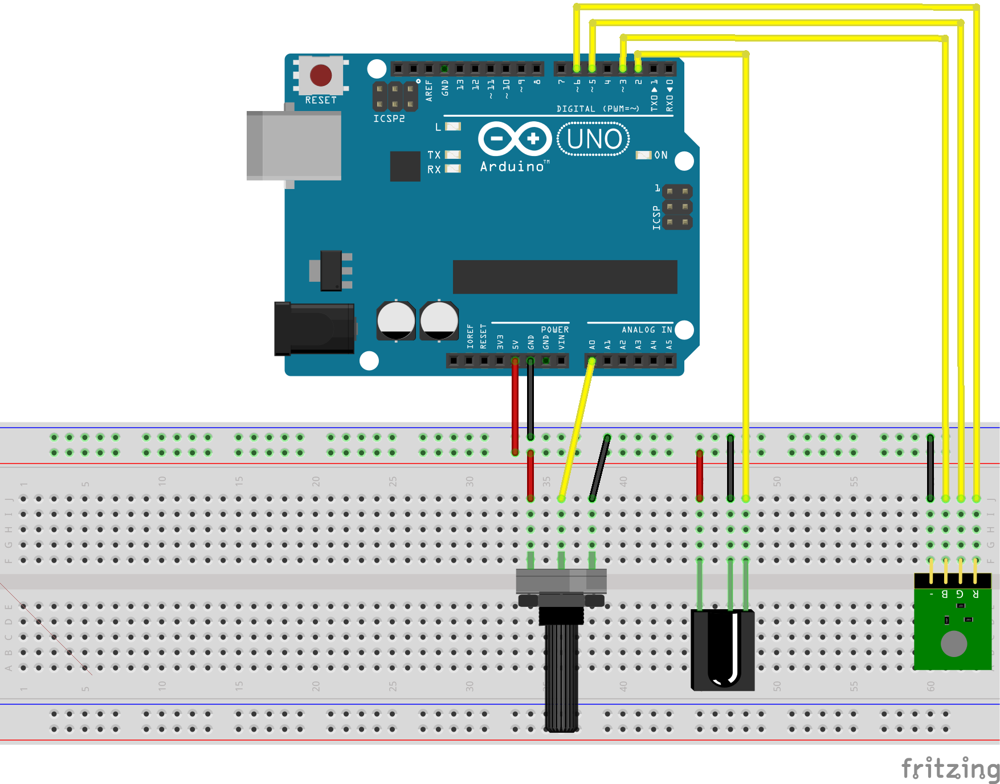

---
author: Fred Cahill, Shawn Nock
institute: Unlondon Digital Media Assoc.
title: Introduction to Art Engineering
subtitle: Medway High School
lang: en-CA
colorlinks: true
...

# Goals

## Art Engineering

- Science, technology, engineering and maths; in service of Art.
- Allows unprecedented interactivity
- Reach Kids, non-traditional art audiences
- Opens doors to new funding sources, non-traditional gallery space.

## Unlondon

- 121Studios: Coworking for Creatives
- Unlab: Hackerspace
- Events: STEAM Outreach & Edu., ExplodeConf, Nuit Blanche

## Shawn: Day Job

Freelance Engineer, Father

- Indoor location tracking w/ Bluetooth
- Keychain / Fitness Band Widgets
- Joystick for VR
- Remote Controls
- Internet of S*#t

## Shawn: The Fun Stuff

Hacker, Church of the Weird Machine, Odd Duck

\begin{columns}[c]
\column{0.50\textwidth}

\begin{itemize}
\item Arduino compatible implant
\item EEG Games / Toy Hacking
\item Brain Stimulation
\item Be Weird, Make Weird, Have Fun!
\item Bad at "Art"
\end{itemize}

\column{0.50\textwidth}
\begin{center}
\includegraphics[width=0.95\textwidth]{images/timbo.jpg}
\vspace{5mm}
\includegraphics[width=0.95\textwidth]{images/circadia.jpg}
\end{center}
\end{columns}

## @scanlime: Micah Elizabeth Scott, Art Engineer

> "...she explores the boundaries between technology, society, and creative
> expression, using her unique perspective to try and help illuminate
> what makes us human."
[^1]

- [Eclipse](https://www.youtube.com/watch?v=bqGXC6AGlWw)
- [Forest](https://www.youtube.com/watch?v=6HcIPMVUezI)
- [Zen Photon Garden](http://zenphoton.com)

[^1]: Micah's Portfolio Website: [misc.name](http://www.misc.name)

## @kimalpert: Kim Alpert, Aesthetic Engineer

> "With a background in fine art, world music, and carpentry, Kim Alpert
> brings an attention to detail and diverse style to her work."
[^2]

- [Bodyphonic @ National Music Center, Calgary](https://vimeo.com/154004279)

[^2]: Kim's Portfolio Website: [http://aestheticengineer.com](http://aestheticengineer.com)

## Fred: The Vital Info

## Electro Sideshow

\fullImage{images/fred/Electro Sideshow.jpg}

## World Record Tower

\fullImage{images/fred/world record tower for arduino
presentation.jpg}

## Roll Up the Cosmos

\fullImage{images/fred/roll up the cosmos for arduino presentation.jpg}

## Lumarca

\fullImage{images/fred/lumarca for arduino presentation.jpg}

## Knexhibitions

\fullImage{images/fred/knexhibitions for arduino presentation.jpg}

## Canon

\fullImage{images/fred/canon for arduino presentation.jpg}

# What's in your kit?

## Kit Contents

- Arduino Uno R3 Clone
- Solderless Breadboard
- Connecting wires
- LEDs
- Resistors, Potentiometer
- Buzzer
- IR Remote
- IR Receiver

## What is Arduino?

\begin{center}
$\mu$C + reset button + led + USB
\end{center}

It's a kit (on a board) with the bare minimum components to easily use the $\mu$C
hardware. They do the basic, boring design needed for any board, so users only
need to add the neat stuff.

<!-- ## Arduino UNO -->

<!-- The Arduino variety that we are using is the Arduino UNO. -->

<!-- - Processor: Atmel Atmega328p -->
<!-- - Memory: 2K RAM + 32K Flash -->
<!-- - FT232RL Logic-level Serial$\leftrightarrow$USB Chip -->

## Arduino Software

The Arduino folks also adapted an *Integrated Development Environment*
(IDE) to their boards. This IDE allows us to easily write programs for
their boards and then write the programs to the $\mu$C.

\Large Get the Arduino IDE:
[https://www.arduino.cc/en/Main/Software](https://www.arduino.cc/en/Main/Software)

## Installation 

\Large Get installing

# Circuit Basics

## Current

Current is the flow of charge through a circuit. Conventionally we
think of this as happening from HIGH ($+$) to LOW ($-$)

## Voltage / Potential / Resistance

Voltage is how fast the current can move in the circuit. River
metaphor: 

  - current = flow rate: ($\si{\liter\per\second}$)
  - voltage = change in height: ($\si{\meter}$)
  
Other devices in a circuit can impede / effect current flow. We'll
call them resistance(s).

<!-- ## Diode -->

<!-- \begin{columns}[c] -->
<!-- \column{0.50\textwidth} -->

<!-- \begin{itemize} -->
<!-- \item One way value for current\footnotemark[1] -->
<!-- \item LED $\equiv$ Light Emitting Diode -->
<!-- \item Band marks (-)\footnotemark[2] -->
<!-- \item Longer leg marks (+) -->
<!-- \end{itemize} -->

<!-- \column{0.50\textwidth} -->
<!-- \begin{center} -->
<!-- \includegraphics[width=0.75\textwidth]{images/diode.png} -->
<!-- \vspace{5mm} -->
<!-- \includegraphics[width=0.50\textwidth]{images/led.jpg} -->
<!-- \end{center} -->
<!-- \end{columns} -->

<!-- \footnotetext[1]{\tiny \url{https://learn.sparkfun.com/tutorials/diodes}} -->
<!-- \footnotetext[2]{\tiny \url{https://learn.sparkfun.com/tutorials/polarity/diode-and-led-polarity}} -->

<!-- ## Diode Problems -->

<!-- * Diodes don't limit current -->
<!-- * Diodes aren't perfect (some current turned to heat) -->
<!-- * Too much current = Too much heat = \large{BANG} -->
<!-- * How do we limit current? -->

<!-- ## Resistor -->

<!-- \begin{columns}[c] -->
<!-- \column{0.50\textwidth} -->

<!-- \begin{itemize} -->
<!-- \item \emph{Resist} the flow of current -->
<!-- \item Needed for LEDs: $\approx\SI{400}{\ohm}$\\ -->
<!-- (safe for $\le\SI{6}{\volt}$) -->
<!-- \item Button Pull-up/down: $\ge\SI{10}{\kilo\ohm}$ -->
<!-- \item Color coded, Google it -->
<!-- \end{itemize} -->
<!-- \column{0.50\textwidth} -->

<!-- \includegraphics[width=0.98\textwidth]{images/resistor.png} -->

<!-- \end{columns} -->

<!-- ## Ohm's Law -->

<!-- Ohm's Law relates current to potential and resistance. -->

<!-- $$ V = IR $$ -->
<!-- $$ I=\frac{V}{R} $$ -->
<!-- $$ R = \frac{V}{I} $$ -->

<!-- * V = Potential in Volts (\si{\volt}) -->
<!-- * I = Current in Amperes (\si{\ampere}) -->
<!-- * R = Resistance in Ohms (\si{\ohm}) -->

<!-- ## Ohm's Law: Example -->

<!-- The datasheet for an LED says that the maximum continuous current is -->
<!-- \SI{15}{\milli\ampere}. Your circuit operates at \SI{5}{\volt}\footnotemark[1]. How -->
<!-- big should your resistor be? -->

<!-- $$ \si{\ohm} = \frac{\SI{5}{\volt}}{\SI{0.015}{\ampere}} = 333.\overline{3}\si{\ohm} $$ -->

<!-- How much current for our *cheet sheet* value? -->

<!-- $$ \si{\ampere} = \frac{\SI{5}{\volt}}{\SI{400}{\ohm}} = \SI{12.5}{\milli\ampere} $$ -->

<!-- \footnotetext[1]{\tiny Actually, this calculation is inaccurate. LEDs will have a *forward voltage drop* of between \SI{300}{\milli\volt} and \SI{700}{\milli\volt} this should be subtracted from \si{\volt} above... but it's not critical.} -->

<!-- ## Buttons -->

<!-- - Buttons connect _or_ disconnect two wires/parts -->
<!-- - Momentary Switch: Normally Closed (NC), Normally Open (NO)  -->
<!-- - Toggle Switch -->

## Circuits

A circuit is a completed loop from HIGH potential (voltage) to LOW,
which causes current to flow through some other components along the
way.

## Transducers {.fragile}

Often these *other* components are *transducers*, which convert
electrical energy into another sort of energy:

| |
-------|--------:
Speaker|Electrical $\rightarrow$ Sound
Microphone|Sound $\rightarrow$ Electrical
LED|Electrical $\rightarrow$ Light
LED|Light $\rightarrow$ Electrical
Piezoelectric|Electrical $\rightarrow$ Motion

<!-- ## Piezo Buzzer -->

<!-- - Piezoelectric elements change shape when voltage is applied -->
<!-- - Thin discs can be made to oscillate and create sound. -->
<!-- - Contains oscillator circuit -->
<!-- - Two connections: Vcc, GND -->
<!-- - Use a switch; connected = annoying tone, disconnected = glorious silence -->

## Power

The power supply provides the energy to drive the system.

Can be a:

* Voltage Regulator (converts one potential to another)
* Batteries
* Solar Panel

In our circuits, your laptop is converting it's power source to $\SI{5}{\volt}$ and
delivering power to our circuit via USB. You also have a battery pack
for computer-free shenanigans ($\SI{6}{\volt}$).

## $\mu$Controller

Microcontroller ($\mu$C) is a *processor*, *memory* and a few *peripherals* on a standalone
chip.

Processor 
:    is a group of transistors that understands a dozen or so
commands (ADD, SUB, JUMP..)

Memory
:    a circuit that can hold values.

Peripherals
:    Vary chip to chip, but often include timers, communications and
ADC, DAC.

Seems complicated, but really simple. They read a command from the
start of memory, then execute the command. At the end of the command,
read the next command from the next memory cell and
repeat^[some commands change the address of the next fetched command]

## Digital Signals

- Vcc: The power supply of the circuit elements
- GND: The reference voltage (usually \SI{0}{\volt})
- Connecting a part to Vcc = Logical 1
- Connecting to GND = Logical 0
- Connecting to Vcc & Ground is all the $\mu$C can do to talk to the world [^4]

[^4]: w/o fancy peripherals

## $\mu$C + Digital Signals as Switches

If one end of an LED is connected to ground, and the other end is
connected to a pin on a $\mu$Controller, then:

- If the $\mu$C sets the pin HIGH (Vcc, $\SI{5}{\volt}$) then current
will flow from the pin through the LED and turn it on.
- If $\mu$C sets the pin LOW (GND, $\SI{0}{\volt}) then the current
will not flow and the LED is off.

# Let's start programming

## Configure Arduino

\begin{center}
\includegraphics[width=0.98\textwidth]{images/arduino-board.png}
\end{center}

* Board: Arduino/Genuino UNO
* Port: \ldots

## Fetch the Class Code

- Download and extract: [https://nocko.se/assets/arduino-medway.zip](https://nocko.se/assets/arduino-medway.zip)
- File$\rightarrow$Preferences
- Browse for sketchbook
- Point it at the `sketchbook` subfolder of the extracted download
- You should now see a list of projects in the
  File$\rightarrow$Sketchbook menu.

## The Code Environment

\begin{center}
\includegraphics[width=0.5\textwidth]{images/arduino-toolbar.png}
\end{center}

## Your first Program

~~~ C
/* the setup function runs once on reset / power */
void setup() {
  /* set pin 13 as an output */
  pinMode(13, OUTPUT);
}

/* the loop function repeats forever */
void loop() {
  digitalWrite(13, HIGH);   // turn on LED
  delay(1000);              // wait for a second
  digitalWrite(13, LOW);    // turn the off LED
  delay(1000);              // wait for a second
}
~~~

<!-- ## Buzzer: Hardware -->

<!-- \begin{center} -->
<!-- \includegraphics[width=0.98\textwidth]{images/buzzer-breadboard.png} -->
<!-- \end{center} -->

<!-- ## Buzzer: Software -->

<!-- ~~~ C -->
<!-- #define BUZZER 8       /* Make BUZZER same as pin 8 */ -->

<!-- void setup() { -->
<!--   pinMode(BUZZER, OUTPUT); -->
<!--   digitalWrite(BUZZER, HIGH);    /* Turn off buzzer */ -->
<!-- } -->
<!-- void loop() { -->
<!--   digitalWrite(BUZZER, LOW);      /* Turn on buzzer */ -->
<!--   delay(100);                     /* wait for 100ms */ -->
<!--   digitalWrite(BUZZER, HIGH);    /* Turn off buzzer */ -->
<!--   delay(900);                         /* wait 900ms */ -->
<!-- } -->
<!-- ~~~ -->

<!-- ## Push Button: Hardware -->

<!-- \begin{center} -->
<!-- \includegraphics[width=0.98\textwidth]{images/buzzer-button-breadboard.png} -->
<!-- \end{center} -->

<!-- ## Push Button: Software (Part 1) -->

<!-- ~~~ C -->
<!-- #define BUTTON 7 -->
<!-- #define BUZZER 8 -->

<!-- int button_state = 0; -->

<!-- void setup() { -->
<!--   pinMode(BUTTON, INPUT); -->
<!--   pinMode(BUZZER, OUTPUT); -->
<!--   digitalWrite(BUZZER, HIGH); -->
<!-- } -->
<!-- ~~~ -->

<!-- ## Push Button: Software (Part 2) -->

<!-- ~~~ C -->
<!-- void loop() { -->
<!--   button_state = digitalRead(BUTTON); -->
<!--   if (button_state == HIGH) { -->
<!--     digitalWrite(BUZZER, LOW); -->
<!--   } else { -->
<!--     digitalWrite(BUZZER, HIGH); -->
<!--   } -->
<!-- } -->
<!-- ~~~ -->

# Add Some Parts

## Breadboard

\ 

- Connectors gently pinch component leads, wires.
- Have internal connections

## Power Up the Rails

We use the long rows to distribute power. The Arduino outputs
$\SI{5}{\volt}$ on the pin marked `5V`, the reference (GND) is marked
`GND`.

## RGB LED

- Three LEDs in the same package.
- LEDs share the same `GND` ($-$) pin, one ($+$) side of each LED
- Connect `-` to negative rail, R, G, & B to pins 3,5, & 6 on Arduino

\centering
\includegraphics[width=0.60\textwidth]{images/bb+uno+led.png}

## RGB Blink, pt. 1

~~~ C
#define RED 6
...
#define DELAY_MS 1000

void setup() {
  /* initialize digital pin functions */
  pinMode(RED, OUTPUT);
  ...
~~~

## RGB Blink, pt. 2

~~~ C
/* turn the RED LED */
digitalWrite(RED, HIGH);
/* Do nothing for a while */
delay(DELAY_MS);
/* turn the LED off */
digitalWrite(RED, LOW);
delay(DELAY_MS);
/* Continue on to green LED */
digitalWrite(GREEN, HIGH);
...
~~~

# More Parts

## Potentiometer

*Puh - ten - she - ometer*

- *Pot* for short
- A Voltage Divider
- Potential at *Wiper* varies between the two terminals

## ADC: Analog to Digital Converter

- A peripheral of the $\mu$Controller
- Measures Potential, outputs a number
- In our case, $\SI{0}{\volt}\rightarrow0$ and
  $\SI{5}{\volt}\rightarrow1023$
- A0-A5 pins on Arduino can be used
- Fun uses: Reading pot position, sampling audio, reading from sensors

## The Pot Hookup

\ 

Connect center pin to `A0`, outer pins to ($+$) and ($-$) rails

## Pot Code, pt. 1: Variable

Declare a variable:

~~~ C
int delay_ms = 1000;
~~~

`<type> <name> [= <initial value>];` (value optional)

It's a name, like a preprocessor `#define`, but the value can change
at *runtime*

## Pot Code, pt. 2: ADC

`analogRead(`*pin*`)` returns the current state of the pin (0--1023),
it can be assigned to a variable.

~~~ C
void loop() {
  delay_ms = analogRead(A0);
  digitalWrite(RED, HIGH);
  delay(delay_ms);
  ...
~~~

Each time through the loop, a new `delay_ms` value is read. Since the
subsequent delay calls use `delay_ms`, the blink rate changes.

# What else can you do with a light?

## Dimmer Code, pt. 1

New variable:

~~~ C
int brightness = 0;
~~~

## Dimmer Code, pt. 2

`analogWrite(`*pin*, *\<0--255\>*`)`, sets the *average* voltage to
$\SI{0}{\volt}$ @ 0 to $\SI{5}{\volt}$ @ 255.

~~~ C
void loop() {
  brightness = analogRead(A0) >> 2;
  analogWrite(RED, brightness);
  ...
~~~

## Bitwise Shift

Then number $100$ is the number $4$ in binary.

$0c100 << 1 = 0b1000 = 8$

$0b100 >> 1 = 0b10 = 2$

$0b10 >> 1 = 0b1 = 1$

Many $\mu$C do no have multiplication/division hardware, and they take
a lot of time and power to fake it. For powers of two, shifting is
faster/better.

## PWM

\begin{columns}[c]
\column{0.50\textwidth}
If $\mu$C can only output 0 and 1, how does "analogWrite" work?

\vspace{5mm}

We can turn the pin on and off very quickly and vary the *duty cycle*
(the percentage of time the pin is HIGH).

\column{0.50\textwidth}

\includegraphics{images/pwm.png}

\centering
\tiny Image courtesy of Arduino.cc
\end{columns}

# Remote Control

## IR Receiver

\centering
{ width=70% }\ 

\raggedright
Neat piece of kit. Internally demodulates IR signal @
$\SI{38}{\kilo\hertz}$ and outputs 16 bit code (unique to each button).

## Remote Control: Hardware Setup

\centering
{ width=70% }\ 

\raggedright
`OUT` of IR Receiver connects to pin `2` of Arduino, `GND` (middle)
`GND` rail, remaining pin to `Vcc` rail.

## Remote Control: Code, pt. 1

Imports and libraries. You can include code from other files using
`#include`. These are often used to include library code, for example
below the `IRremote.h` file includes declarations that allow us to use
objects / methods from the IRremote library.

~~~ C
#include <IRremote.h>
#include "medway-remote.h"
~~~

## Remote Control: Code, pt. 2

~~~ C
bool power = false;

/* Initialize the irrecv part of the IRremote  library */
IRrecv irrecv(IR_PIN);
decode_results results;

void setup() {
  ...
  irrecv.enableIRIn();
}
~~~

## Bitwise AND

A function that compares the bit-by-bit two numbers. For each bit, it
returns 1 if both input bits are 1, else 0. Examples

- 5 & 1 = 1; 0b101 & 0b001 = 0b001
- 241 & 133 = 129; 0b11110001 & 0b10000101 = 0b10000001

Why use this? Setting or clearing ranges of bits.

0xF = 0b00001111, so anything `&` 0xF will clear any bits *left* of
the last four.

## Remote Control: Code, pt. 3

~~~ C
void loop() {
  if (irrecv.decode(&results)) {
    uint16_t resultCode = (results.value & 0xFFFF);
    switch (resultCode) {
	  ...
      case ONE:
        digitalWrite(RED, !digitalRead(RED));
        break;
      case TWO:
        digitalWrite(GREEN, !digitalRead(GREEN));
        break;
~~~

## Remote Control: Code, pt. 4

~~~ C
irrecv.resume();
~~~

This tells the IR Receiver library that we've processed the current
code, and it can provide (or wait) for the next one.

# Where to go next?

## Light Painting

Program a blink / fade (see Fade example in sketchbook) / colour
pattern into your led(s). Take a long exposure / multiple exposure
photograph as you move the project around the room.

## Buzzer

Hook up one end of the Piezo buzzer (black cylinder) to `GND` rail and
the other to a $\mu$Controller pin (sample code in remote
sketch). Turn on the buzzer and watch Fred and I squirm.

## Other sensors

Your kit also contains a photoresistor, try hooking it up to an ADC
pin. Your kit also has a modified LED that can act as a *flame
sensor*, it may be fun to play with\ldots.

## The End?

\begin{center}
\LARGE{Let's build some cool stuff!}
\end{center}
